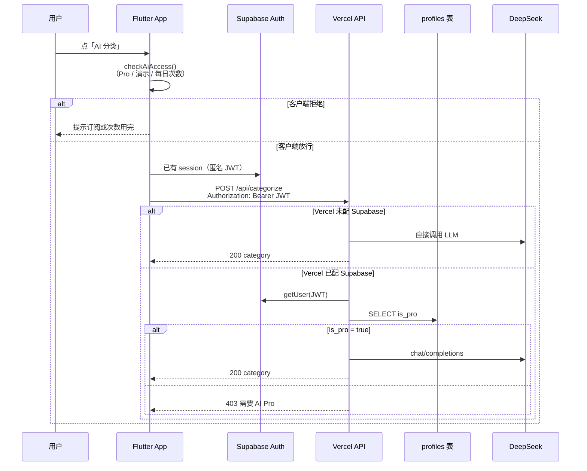

# API 鉴权模型（教学文档）

_最后更新：2026-05-20_

本文说明 Expense Tracker **Vercel Serverless API** 与 **Flutter 客户端** 如何协同鉴权，适合 Workshop / 课堂单独讲解。部署与环境变量见 [API-DEPLOY.md](API-DEPLOY.md)；身份与 IAP 产品方向见 [SYNC-AND-IAP-DESIGN.md](SYNC-AND-IAP-DESIGN.md)。

---

## 1. 设计目标（一句话）

- **DeepSeek API Key 只放在服务端**（Vercel 环境变量），App 里永远不打包 LLM 密钥。
- **调用 AI 接口的人**必须是：已登录的 Supabase 用户（匿名也算）+ **`profiles.is_pro = true`**（开启鉴权时）。
- **用户无注册 UI**：App 启动时 `signInAnonymously()`，JWT 在后台自动刷新。

---

## 2. 双端是否「一致」？—— 结论先讲

| 维度 | 是否一致 | 说明 |
|------|----------|------|
| 身份凭证 | ✅ 一致 | 都用 **Supabase 用户 JWT**（`Authorization: Bearer <access_token>`） |
| 权益数据来源 | ✅ 一致 | 都以 Supabase **`profiles.is_pro`** 为权威（服务端查表；客户端缓存同字段） |
| 是否强制鉴权 | ⚠️ 可不一致 | 服务端仅当 Vercel 配置了 `SUPABASE_URL` + `SUPABASE_SERVICE_ROLE_KEY` 才校验；未配置则 **AI 接口对公网开放** |
| Pro 校验时机 | ⚠️ 双层 | **客户端先拦**（UX + 本地配额）；**服务端再拦**（防刷 Key）—— 两层逻辑不同 |
| 每日 AI 次数 | ❌ 不一致 | **仅客户端** `SubscriptionService`（默认 3 次/天）；服务端 **不** 计次 |
| 演示模式 | ❌ 仅客户端 | `ai_demo_mode` 可绕过客户端 Pro 检查，**不能**绕过服务端 `requirePro`（除非服务端也未开鉴权） |

**课堂表述建议：**

> 双端在「谁是谁」（JWT）和「有没有 Pro」（`is_pro`）上是对齐的；  
> 在「什么时候拦、拦什么」上故意分成两层——客户端管体验与配额，服务端管密钥与真实权益。

---

## 3. 整体架构



---

## 4. 服务端（Vercel / Node）

### 4.1 鉴权开关

实现：`api/_lib/supabase.js` → `isAuthEnforced()`

```javascript
// 两个变量都有值 → 开启鉴权；缺一 → AI 接口不校验（兼容旧部署）
SUPABASE_URL + SUPABASE_SERVICE_ROLE_KEY
```

| 状态 | `/api/categorize`、`/api/insight` |
|------|-----------------------------------|
| 未开启 | 任何人 `curl` 即可调用（只消耗 DeepSeek 额度） |
| 已开启 | 必须 Bearer JWT + `profiles.is_pro === true` |

### 4.2 `requirePro`（AI 接口）

用于：`api/categorize.js`、`api/insight.js`。

| 步骤 | 行为 |
|------|------|
| 1 | 从 Header 解析 `Authorization: Bearer <token>` |
| 2 | `createClient(SUPABASE_URL, SERVICE_ROLE_KEY).auth.getUser(token)` 验 JWT |
| 3 | `profiles` 表 `user_id = auth.user.id`，读 `is_pro` |
| 4 | `is_pro !== true` → **403** `{ "error": "需要 AI Pro 订阅" }` |

**为何用 Service Role？**  
服务端要用管理员权限读任意用户的 `profiles`（不受 RLS「只能读自己」限制），同时仍用 **用户 JWT** 证明「当前是谁」。

### 4.3 `getUserFromToken`（`/api/me`）

用于：`api/me.js` — **只验登录，不要求 Pro**。

- `GET /api/me` + Bearer JWT → `{ "user_id", "is_pro" }`
- 供 App 在直连 Supabase 失败时 **回退** 拉取 Pro 状态（见 `SubscriptionService.refreshEntitlement`）。

### 4.4 `dev-activate-pro`（Workshop，非 JWT）

用于：`api/dev-activate-pro.js`。

| 字段 | 说明 |
|------|------|
| `secret` | 必须等于环境变量 `DEV_PRO_SECRET` |
| `user_id` | 要开通 Pro 的 Supabase `auth.users.id` |

用 Service Role **upsert** `profiles.is_pro = true`。这是运维/课堂用接口，**不是** 面向最终用户的鉴权方式。

### 4.5 HTTP 状态码（服务端）

| 状态码 | 含义 |
|--------|------|
| 401 | 未带 JWT，或 JWT 无效/过期 |
| 403 | JWT 有效但非 Pro |
| 500 | 读 `profiles` 失败等服务器错误 |
| 405 | 方法不对（仅 POST/GET 见各路由） |

### 4.6 CORS

`api/_lib/http.js` 设置 `Access-Control-Allow-Origin: *`，允许带 `Authorization` 的跨域请求。  
**安全不依赖「隐藏 URL」**，而依赖 JWT + `is_pro`（鉴权开启时）。

### 4.7 密钥分层

| 密钥 | 位置 | 用途 |
|------|------|------|
| `DEEPSEEK_API_KEY` | 仅 Vercel | 调 DeepSeek |
| `SUPABASE_SERVICE_ROLE_KEY` | 仅 Vercel | 验 JWT、写 `profiles` |
| Supabase **anon key** | Flutter | 匿名登录、RLS 下读写自己的 `expenses` |
| 用户 **access_token** | Flutter session | 调 Vercel AI API 时放在 Bearer |

---

## 5. 客户端（Flutter）

### 5.1 身份：`AuthService`

- 文件：`lib/data/auth_service.dart`
- 启动时 `ensureAnonymousSession()` → `signInAnonymously()` 或刷新已有 session。
- `accessToken` = `Supabase.instance.client.auth.currentSession?.accessToken`。

### 5.2 带 Token 调 API

- `lib/main.dart` 把 `accessToken: () => authService.accessToken` 注入 `ExpenseRepositoryImpl`。
- `AiCategorizationApiDataSource` / `AiInsightApiDataSource`：若 token 非空，则设置  
  `Authorization: Bearer $accessToken`。

**注意：** 若未配置 Supabase，token 为 `null`，请求 **不带** Authorization——此时能否调通完全取决于服务端是否 `isAuthEnforced()`。

### 5.3 权益与配额：`SubscriptionService`

- 文件：`lib/data/subscription_service.dart`
- **Pro 判断**：`isAiProActive = isDemoMode || isProCached`（本地缓存，来源见下）。
- **刷新 Pro**：优先直连 Supabase `profiles.is_pro`；失败则 `GET /api/me`。
- **AI 入口前**：`checkAiAccess()` — 非 Pro / 非演示 / 每日次数 ≤ 0 则 **不发起** API 请求。
- **次数**：`consumeAiCall()` 成功后扣本地 `ai_calls_remaining`（默认每日 3，**仅客户端**）。

UI 调用点示例：

- `add_expense_screen.dart` → `_runAiCategorize()` 先 `checkAiAccess()`
- `reports_screen.dart` → 月报洞察同理

### 5.4 客户端 vs 服务端对照表

| 检查项 | 客户端 | 服务端 |
|--------|--------|--------|
| 已登录（有效 JWT） | 间接（有 token 才能带 Header；不单独弹「请登录」） | ✅ `getUser(token)` |
| `is_pro` | ✅ 缓存 + 刷新 | ✅ `requirePro` 查表 |
| 每日 3 次 | ✅ | ❌ |
| 演示模式 | ✅ 本地绕过 | ❌ |
| 防 curl 刷接口 | ❌（可被绕过） | ✅（鉴权开启时） |

---

## 6. API 端点一览

| 路径 | 方法 | 鉴权方式 | 响应要点 |
|------|------|----------|----------|
| `/api/categorize` | POST | Bearer JWT + Pro* | `{ "category": "交通" }` |
| `/api/insight` | POST | Bearer JWT + Pro* | `{ "insight": "..." }` |
| `/api/me` | GET | Bearer JWT | `{ "user_id", "is_pro" }` |
| `/api/dev-activate-pro` | POST | Body `secret` + `user_id` | `{ "ok": true, ... }` |

\* 见 §4.1：未配置 Supabase 服务端变量时不校验。

**Body 约定：**

- `categorize`：`{ "amount", "note" }`
- `insight`：`{ "year", "month", "totals" }`，`totals` 值为 **分（整数）**

---

## 7. 课堂演示：curl 流程

前提：Vercel Production 已配置 `DEEPSEEK_API_KEY`、`SUPABASE_URL`、`SUPABASE_SERVICE_ROLE_KEY`。

### 7.1 无 Token（应失败）

```bash
curl -sS -X POST "$API_BASE/api/categorize" \
  -H 'Content-Type: application/json' \
  -d '{"amount":"62.60","note":"的士"}'
# 期望：401 需要登录（Bearer JWT）
```

### 7.2 有 JWT 但未 Pro（应 403）

从 App 日志、Supabase Dashboard → Authentication → Users，或匿名登录 API 取得 `access_token`。

```bash
curl -sS -X POST "$API_BASE/api/categorize" \
  -H 'Content-Type: application/json' \
  -H "Authorization: Bearer $ACCESS_TOKEN" \
  -d '{"amount":"62.60","note":"的士"}'
# 期望：403 需要 AI Pro 订阅
```

### 7.3 Workshop 开通 Pro

```bash
curl -sS -X POST "$API_BASE/api/dev-activate-pro" \
  -H 'Content-Type: application/json' \
  -d "{\"secret\":\"$DEV_PRO_SECRET\",\"user_id\":\"$USER_ID\"}"
```

再执行 7.2 → 期望 **200** 且 `category` 为固定类别之一。

### 7.4 查询权益

```bash
curl -sS "$API_BASE/api/me" \
  -H "Authorization: Bearer $ACCESS_TOKEN"
# 期望：{"user_id":"...","is_pro":true}
```

---

## 8. 环境变量清单（鉴权相关）

| 变量 | 端 | 必填（生产收紧） | 作用 |
|------|-----|------------------|------|
| `DEEPSEEK_API_KEY` | Vercel | ✅ | LLM |
| `SUPABASE_URL` | Vercel + Flutter | 鉴权/同步时 ✅ | 同一项目 |
| `SUPABASE_SERVICE_ROLE_KEY` | **仅 Vercel** | 鉴权时 ✅ | 验 JWT、写 Pro |
| `SUPABASE_ANON_KEY` | **仅 Flutter** | 同步时 ✅ | 匿名登录、RLS |
| `DEV_PRO_SECRET` | Vercel | 课堂可选 | dev-activate-pro |
| `API_BASE_URL` | Flutter build | ✅ | Vercel 域名 |

模板：仓库根目录 [`.env.example`](../.env.example)。

---

## 9. 数据模型（与鉴权相关）

迁移：`supabase/migrations/001_sync_schema.sql`

```text
profiles
  user_id   uuid  PK  → auth.users.id
  is_pro    boolean   → AI + 云同步权益
```

- 新用户触发器自动插入 `profiles` 行（`is_pro` 默认 `false`）。
- RLS：用户 JWT 只能读写 **自己的** `profiles` / `expenses`。
- Vercel 用 **Service Role** 绕过 RLS 做鉴权与 Workshop 写 `is_pro`。

---

## 10. 已知缺口与后续（讲课可提）

1. **IAP 收据校验未接**：生产应通过 Apple/Google 收据 API 写 `is_pro`，而非长期依赖 `dev-activate-pro`。
2. **服务端无每日配额**：防滥用需在 API 层加计数（Redis / Supabase 表 / Vercel KV）。
3. **鉴权未配置 = 公开 AI**：部署 checklist 必须包含 Supabase 两个服务端变量。
4. **`dev-activate-pro`**：生产应禁用或极强 secret + 仅 Preview 环境。
5. **恢复购买 / 换机**：见 [SYNC-AND-IAP-DESIGN.md](SYNC-AND-IAP-DESIGN.md) 的 entitlement 迁移设计。

---

## 11. 源码索引（方便带学生翻代码）

| 主题 | 路径 |
|------|------|
| 服务端 Pro 门禁 | `api/_lib/supabase.js` → `requirePro` |
| 分类 API | `api/categorize.js` |
| 洞察 API | `api/insight.js` |
| `/api/me` | `api/me.js` |
| Workshop 开 Pro | `api/dev-activate-pro.js` |
| Bearer 解析 / CORS | `api/_lib/http.js` |
| 匿名登录 | `lib/data/auth_service.dart` |
| 本地 Pro / 配额 | `lib/data/subscription_service.dart` |
| 带 Token 请求 | `lib/data/datasources/ai_categorization_api_data_source.dart` |
| UI 入口拦截 | `lib/presentation/screens/add_expense_screen.dart` |

---

## 12. 相关文档

- [API-DEPLOY.md](API-DEPLOY.md) — Vercel 部署与端点列表  
- [SUPABASE-SETUP.md](SUPABASE-SETUP.md) — Supabase 项目、匿名登录、迁移  
- [SYNC-AND-IAP-DESIGN.md](SYNC-AND-IAP-DESIGN.md) — 云同步与 IAP 产品架构  
