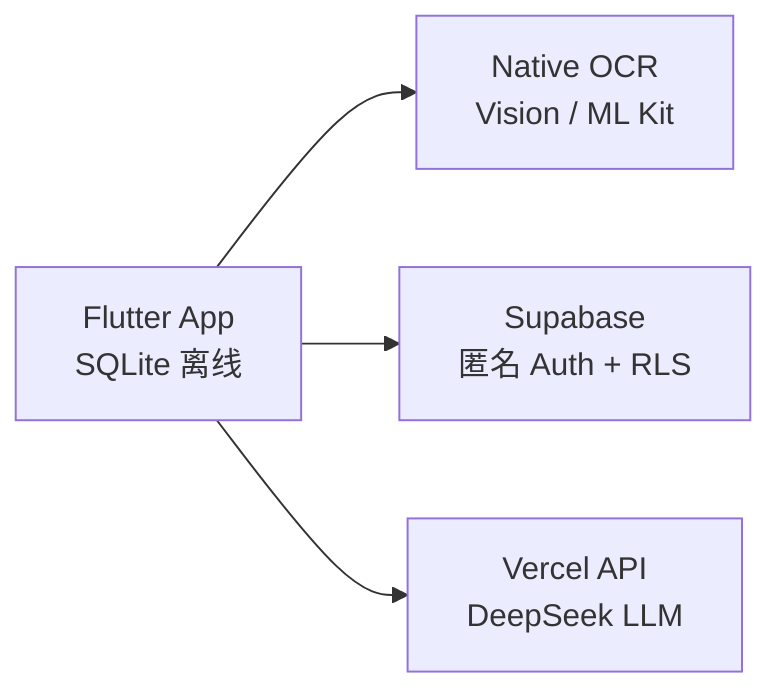

# Expense Tracker — 路演演示文稿

_版本：1.0 · 更新：2026-05-21_

> **使用说明：** 本文按幻灯片分页，可直接用于 Keynote / PowerPoint / Marp 转换。  
> 建议时长：**8–10 分钟**（含 2 分钟 Demo）。

---

## Slide 1 — 封面

# Expense Tracker
### 拍一下 · 选一下 · 记完了

**智能记账 App — 香港 AI 创业教育示例项目**

- Flutter 双端（iOS + Android）
- 离线 OCR + AI 分类 + 云同步

_2026 · OPC/21days_

---

## Slide 2 — 痛点

# 为什么还需要一款新的记账 App？

| 用户说 | 现状 |
|--------|------|
| 「记一笔太麻烦」 | 打开 App → 填 4 个字段 → 放弃 |
| 「OCR 经常填错」 | 的士 62.60 被识别成 52.60，用户还得改 |
| 「不想注册」 | 邮箱、手机号、微信授权 — 门槛太高 |
| 「换了手机数据没了」 | 免费版无云同步，或仅 iCloud 绑 iOS |

**机会：** 快、准、零注册 — 用 AI 辅助而非替代用户判断。

---

## Slide 3 — 解决方案

# Expense Tracker 怎么做？

```
📸 拍收据        →  本地 OCR，离线可用
👆 选金额        →  候选列表，用户确认（不自动猜）
✨ AI 建议分类   →  Pro 用户一键采纳
☁️ 云端同步      →  换机不丢数据
```

**一句话：** OCR 负责「看见」，用户负责「判断」，AI 负责「建议」。

---

## Slide 4 — 产品演示流程（Demo 脚本）

# Live Demo — 90 秒记一笔

**场景：** 香港出租车小票 HK$47.40

1. 打开 App → 点「记一笔」
2. 从相册选测试图（`IMG_0060` 的士小票）
3. OCR 弹出候选：
   - ✅ **Total: HK$47.40**（置顶推荐）
   - 其他数字 / 疑似日期警告
4. 点选确认 → 选类别「交通」→ 保存
5. 切到「报表」→ 看月度饼图变化

**Pro 用户额外一步：** AI 卡片推荐「交通 🚕 置信度 92%」→ 确认

---

## Slide 5 — 功能矩阵

# 免费 vs AI Pro

| | 免费 | AI Pro |
|---|:---:|:---:|
| 本地记账 | ✅ | ✅ |
| OCR 拍照 | ✅ | ✅ |
| CSV 导出 | ✅ | ✅ |
| 云同步 | | ✅ |
| AI 分类 | | ✅ |
| 月报洞察 | | ✅ |

**商业模式：** 订阅制解锁 AI + 云同步；OCR 与本地能力永久免费。

---

## Slide 6 — 目标用户

# 谁在用？

| 用户群 | 场景 |
|--------|------|
| 🇭🇰 香港日常用户 | 的士小票、PayMe / FPS 支付截图 |
| 📱 轻量记账需求 | 不想学复杂财务软件 |
| 🎓 课程学员 | 全栈 AI App 开发实战 |
| 🚀 独立开发者 | 可 fork 的上架级 MVP 模板 |

**初期市场：** 香港华语用户 + AI 创业课程生态

---

## Slide 7 — 技术亮点（给投资人 / 评委）

# 技术架构 — 轻量但完整



| 亮点 | 价值 |
|------|------|
| **Clean Architecture** | 可测试、可替换 LLM / 后端 |
| **无注册匿名 Auth** | 零摩擦 onboarding |
| **双层鉴权** | 客户端 UX + 服务端防刷 Key |
| **OCR 候选而非自动填** | 降低误识别投诉 |
| **同一 codebase 双端** | 一套代码 iOS + Android |

---

## Slide 8 — 竞争差异

# 我们有什么不同？

| 维度 | 传统记账 | Expense Tracker |
|------|----------|-----------------|
| 注册 | 必填 | **无注册，打开即用** |
| OCR | 自动填入，易错 | **候选列表 + 用户确认** |
| 云同步 | 常绑 iCloud | **Supabase 双端一致** |
| AI | 黑盒自动化 | **建议 + 置信度 + 用户确认** |
| 离线 | 部分强依赖网 | **SQLite 离线优先** |

**护城河：** 香港本地化 OCR 规则 + 「不猜金额」的产品哲学。

---

## Slide 9 — 当前进展

# 项目状态 — 2026 年 5 月

| 阶段 | 内容 | 状态 |
|------|------|------|
| Phase 1 | 记账 / 报表 / SQLite / CSV | ✅ 完成 |
| Phase 2 | 双端 OCR + 金额候选 UI | 🔄 进行中 |
| Phase 3 | Supabase 同步 + IAP | 🔄 架构已就绪 |
| Phase 4 | AI 静默分类 + 换机迁移 | 📋 设计中 |

**已可演示：** 完整记账流程 + OCR + AI 演示模式 + 云同步（Workshop Tier B）

---

## Slide 10 — 路线图

# 接下来 6 个月

```
Q2 2026 ──► OCR 置信度提示 + 候选 UI 完善
         ──► 真 IAP 上线（StoreKit / Play Billing）

Q3 2026 ──► 恢复购买 + 换机数据迁移
         ──► AI 静默分类（金额确认后自动建议）

Q4 2026 ──► App Store / Google Play 上架
         ──► 预算预警 + 行为洞察（Module E）
```

---

## Slide 11 — 商业模式

# 怎么赚钱？

| 收入来源 | 说明 |
|----------|------|
| **AI Pro 订阅** | 月费 / 年费，解锁 AI + 云同步 |
| **AI 调用配额** | 客户端每日限额（默认 3 次），防滥用 |
| **课程授权** | 作为 OPC/21days 教学模板（B2B2C） |

**成本结构：**

- Supabase 免费档 → 早期用户足够
- DeepSeek API 按 token 计费 → 随订阅摊薄
- 无自建服务器 → Vercel Serverless 按量

---

## Slide 12 — 团队与背景

# 为什么是我们？

- **课程背书：** 香港 AI 创业教育（OPC/21days）官方示例 App
- **全栈覆盖：** Flutter + Native OCR + Supabase + LLM + IAP 完整链路
- **可复现：** 开源 codebase + Workshop 三层教程（Tier A/B/C）
- **可演进：** 从 Demo 到上架的 Git Tag 里程碑（v1.0 → v7.0）

---

## Slide 13 — 数据与隐私（合规话术）

# 用户数据怎么处理？

| 数据 | 处理方式 |
|------|----------|
| 记账记录 | 默认本地 SQLite；Pro 可选云同步 |
| 收据图片 | **仅本地 OCR，不上传** |
| 用户身份 | Supabase 匿名 UUID，无邮箱/手机 |
| AI 请求 | 仅发送结构化文本（金额、类别、备注） |
| 密钥 | LLM Key 仅存服务端，不进 App |

**合规友好：** 最小化采集，RLS 行级隔离，用户可随时 CSV 导出。

---

## Slide 14 — 融资 / 合作诉求（可选）

# 我们在寻找什么？

| 类型 | 诉求 |
|------|------|
| **种子用户** | 香港记账用户内测，验证 OCR 准确率 |
| **技术合作** | OCR 精度优化、LLM 分类微调 |
| **渠道合作** | 理财 / 金融科技 App 嵌入或 white-label |
| **投资** | 用于 IAP 上架、运营、LLM 成本（如适用） |

---

## Slide 15 — 总结

# Expense Tracker

> **拍一下、选一下、记完了**

- ✅ 零注册、离线可用、双端一致
- ✅ OCR 候选 + AI 建议，人机协作而非黑盒
- ✅ 完整技术栈，从 MVP 到商业化的清晰路径

**Contact / Demo**

- Repo: `expense_tracker`
- Docs: [PRODUCT.md](PRODUCT.md) · [TECHNICAL.md](TECHNICAL.md)
- Demo: `./scripts/run-ios.sh`

---

## 附录 A — Demo 检查清单（讲者用）

**课前准备：**

- [ ] `.env.local` 已配置 `API_BASE_URL`（AI 演示）
- [ ] （可选）`SUPABASE_URL` + `SUPABASE_ANON_KEY`（云同步 Demo）
- [ ] iOS 模拟器已导入测试图：`./scripts/import-test-receipts-ios.sh`
- [ ] 设置 → 开启「AI 演示模式」（若无 Pro）

**Demo 顺序建议：**

1. 空列表 → 强调零注册
2. OCR 记一笔（的士小票）→ 强调候选不自动填
3. 报表饼图 → 视觉 impact
4. （可选）Supabase Dashboard 看同步数据
5. （可选）AI 分类 + 月报洞察

**备用话术（若 OCR 慢）：** 「OCR 完全离线，首次识别约 1–2 秒，后续可优化。」

---

## 附录 B — 常见问题（Q&A）

**Q: 和 MoneyCoach / 随手记有什么区别？**  
A: 我们更轻、无注册、OCR 不自动填金额、AI 是建议而非强制，且双端云同步不绑 iCloud。

**Q: OCR 准确率如何？**  
A: 香港小票 Top-3 候选含正确金额 > 90%（内部测试）；置信度 UI 即将上线进一步辅助用户。

**Q: 没有网络能用吗？**  
A: 能。记账和 OCR 完全离线；AI 和云同步需网络。

**Q: 数据安全吗？**  
A: 本地优先；云端 RLS 隔离；收据图不上传；可随时 CSV 导出。

**Q: 怎么变现？**  
A: AI Pro 订阅（AI 分类 + 洞察 + 云同步）；OCR 和本地记账免费。

---

## 附录 C — Marp 转换提示

若使用 [Marp](https://marp.app/) 导出 PDF/PPT，可在文件头加入：

```markdown
---
marp: true
theme: default
paginate: true
header: 'Expense Tracker'
footer: 'OPC/21days · 2026'
---
```

每个 `## Slide N` 之间用 `---` 分页即可。
