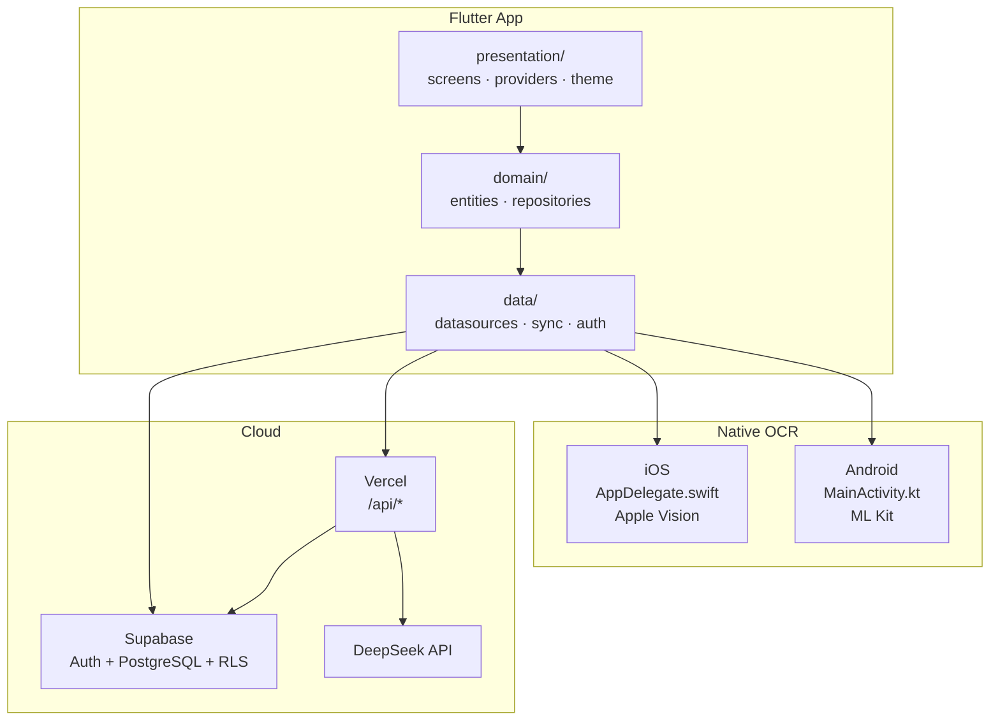

# Expense Tracker — 技术方案文档

_版本：1.0 · 更新：2026-05-21_

---

## 1. 文档范围

本文描述 Expense Tracker 的技术架构、模块划分、数据模型、接口设计与部署方案。产品功能与用户旅程见 [PRODUCT.md](PRODUCT.md)。

---

## 2. 技术栈总览

| 层级 | 技术选型 | 版本 / 说明 |
|------|----------|-------------|
| 客户端框架 | Flutter | 3.24+，Dart SDK ^3.5 |
| 架构模式 | Clean Architecture | presentation / domain / data |
| 状态管理 | Provider | ^6.1 |
| 本地数据库 | sqflite | SQLite |
| 图表 | fl_chart | 月度饼图 |
| 国际化 | intl + flutter_localizations | 默认 zh_CN |
| 身份认证 | supabase_flutter | 匿名 Auth |
| 云端数据库 | Supabase PostgreSQL | RLS 行级安全 |
| 后端 API | Vercel Serverless | Node.js |
| LLM | DeepSeek | 经 Vercel 代理，密钥不进 App |
| OCR (iOS) | Apple Vision | MethodChannel |
| OCR (Android) | Google ML Kit | MethodChannel |

**支持平台：** iOS、Android（同一 codebase）；Web / Desktop 目录存在但未作为主交付目标。

---

## 3. 系统架构



### 3.1 设计原则

- **离线优先：** SQLite 为 Source of Truth，云同步为 Pro 增值能力
- **密钥隔离：** LLM / Service Role Key 仅存在于 Vercel 环境变量
- **双层鉴权：** 客户端 UX 配额 + 服务端 JWT + `is_pro` 校验
- **平台 OCR 原生实现：** Dart 层统一 `ExpenseOcrDataSource` 接口

---

## 4. 客户端架构

### 4.1 目录结构

```
lib/
├── main.dart                          # 启动、依赖注入
├── core/
│   ├── api_config.dart                # Vercel API Base URL
│   └── supabase_config.dart           # Supabase URL / Anon Key（编译注入）
├── domain/
│   ├── entities/
│   │   ├── expense.dart
│   │   └── expense_category.dart
│   └── repositories/
│       └── expense_repository.dart    # 抽象接口
├── data/
│   ├── auth_service.dart              # signInAnonymously、JWT
│   ├── subscription_service.dart      # Pro 权益、AI 配额
│   ├── sync_service.dart              # 本地 ↔ 云端同步
│   ├── repositories/
│   │   └── expense_repository_impl.dart
│   └── datasources/
│       ├── expense_local_data_source.dart    # SQLite
│       ├── expense_remote_data_source.dart   # Supabase
│       ├── expense_ocr_data_source.dart      # OCR 抽象 + OcrResult
│       ├── apple_vision_ocr_data_source.dart
│       ├── ocr_factory.dart
│       ├── ai_categorization_api_data_source.dart
│       ├── ai_categorization_mock_data_source.dart
│       └── ai_insight_api_data_source.dart
└── presentation/
    ├── screens/                       # home_shell, list, add, reports
    ├── providers/                     # ExpenseListController 等
    ├── sync_scope.dart                # SyncService InheritedWidget
    └── theme/
```

### 4.2 启动流程

```dart
// main.dart 简化流程
1. WidgetsFlutterBinding.ensureInitialized()
2. Supabase.initialize()          // 若 SUPABASE_URL / ANON_KEY 已配置
3. AuthService.ensureAnonymousSession()
4. ExpenseLocalDataSource.open()  // SQLite
5. SubscriptionService.create() + refreshEntitlement()
6. SyncService(...)               // 若 Supabase 已配置
7. ExpenseRepositoryImpl(...)
8. syncNow()                      // Pro 用户后台同步
9. runApp(MultiProvider + SyncScope + MaterialApp)
```

### 4.3 Provider 依赖图

```
ExpenseRepository ──► ExpenseListController (ChangeNotifier)
SubscriptionService ──► 设置页 / AI 入口检查
SyncService ──► SyncScope ──► 设置页「立即同步」
ShellNavigationController ──► 底部三 Tab
ReportMonthController ──► 报表月份切换
```

---

## 5. OCR 技术方案

### 5.1 通道与平台

| 平台 | MethodChannel | 原生实现 |
|------|---------------|----------|
| iOS | `expense_tracker/ocr` | Swift + `VNRecognizeTextRequest` |
| Android | `expense_tracker/ocr_android` | Kotlin + ML Kit `TextRecognizer` |

### 5.2 数据模型（V2）

```dart
class AmountCandidate {
  final String value;           // "47.40"
  final String raw;             // "HK$47.40"
  final String? context;        // 所在行完整文字
  final bool isLikelyTotal;     // total/总计/实付 等
  final bool isSuspicious;      // 疑似年份 1900~2100
  final double? confidence;     // 0.0~1.0（待透传）
}

class OcrResult {
  final String rawText;
  final List<AmountCandidate> amountCandidates;
  final String? merchant;
}
```

### 5.3 金额提取逻辑

**Android (Kotlin)：**

1. ML Kit 识别全文
2. 逐行匹配金额正则
3. 标注 `isLikelyTotal`（含 total/总计/合计/金额/总额/实付/应付/小计）
4. 标注 `isSuspicious`（1900–2100 且 .00）
5. 返回全部候选（不自动选最大值）

**iOS (Swift / Dart fallback)：**

1. Vision OCR 逐行识别
2. HK$ / HKD / 港幣 专用正则
3. 同上标注逻辑

**工厂模式：** `ocr_factory.dart` 按平台选择 DataSource。

---

## 6. 数据层设计

### 6.1 本地 SQLite

- 表：`expenses`（id, amount, category_index, note, date, updated_at, deleted_at）
- 软删除：`deleted_at` 非空表示已删，同步时上行 tombstone
- 主存储，无网络可读写

### 6.2 云端 Supabase

**迁移脚本：** `supabase/migrations/001_sync_schema.sql`

```text
auth.users              -- Supabase 管理（含匿名用户）

profiles
  user_id               PK → auth.users
  is_pro                boolean
  iap_product_id        text, nullable
  iap_original_tx_id    text, unique（恢复购买关键）
  created_at / updated_at

expenses
  id                    uuid
  user_id               → auth.users
  amount, category_index, note, date
  updated_at            冲突解决
  deleted_at            软删除
```

**RLS 策略：**

```sql
-- 用户只能读写自己的行
using (auth.uid() = user_id)
```

**触发器：** 新 auth user 自动插入 `profiles` 行。

### 6.3 同步策略（SyncService）

| 方向 | 触发 | 逻辑 |
|------|------|------|
| 上行 | 本地 CRUD 后 | 推送变更至 Supabase |
| 下行 | 启动 / 手动同步 | 拉取远端，按 `updated_at` 合并 |
| 冲突 | 同 id 双端修改 | Last-Write-Wins（`updated_at` 较新者胜） |

**前置条件：** `SubscriptionService.canUseCloudSync == true` 且 Supabase 已配置。

---

## 7. 身份与订阅

### 7.1 匿名 Auth

```dart
// AuthService
await Supabase.instance.client.auth.signInAnonymously();
// session.user.id 作为全链路 user_id
// JWT 自动刷新，持久化于设备
```

**产品层无登录 UI**；`auth.users` 为实现细节。

### 7.2 SubscriptionService

| 字段 / 方法 | 说明 |
|-------------|------|
| `isDemoMode` | Workshop 演示，绕过 Pro 检查 |
| `isProCached` | 本地缓存 `profiles.is_pro` |
| `canUseCloudSync` | Pro + Supabase 已配置 |
| `checkAiAccess()` | 客户端 Pro / 配额检查 |
| `kDailyLimit = 3` | 每日 AI 调用上限（仅客户端） |
| `refreshEntitlement()` | 从 Supabase 或 `/api/me` 刷新 |

### 7.3 IAP 架构（规划）

```text
用户购买 → StoreKit / Play Billing
         → 收据 POST Vercel /api/verify-receipt（待实现）
         → 服务端校验 → profiles.is_pro = true
         → 客户端 refreshEntitlement()

换机 → signInAnonymously()（新 user_id）
     → 「恢复购买」→ 按 iap_original_tx_id 合并 expenses
```

---

## 8. 后端 API（Vercel）

### 8.1 接口清单

| 路径 | 方法 | 功能 | 鉴权 |
|------|------|------|------|
| `/api/categorize` | POST | AI 自动分类 | JWT + is_pro（可选强制） |
| `/api/insight` | POST | 月报洞察 | JWT + is_pro（可选强制） |
| `/api/me` | GET | 返回当前用户 Pro 状态 | JWT |
| `/api/dev-activate-pro` | POST | Workshop 开发激活 Pro | JWT |

**共享库：** `api/_lib/supabase.js`、`deepseek.js`、`http.js`、`categories.js`

### 8.2 鉴权模型

```javascript
// isAuthEnforced() = SUPABASE_URL + SUPABASE_SERVICE_ROLE_KEY 均配置
// 开启后：requirePro() 校验 JWT → profiles.is_pro
// 未开启：AI 接口对公网开放（兼容旧部署 / 本地开发）
```

**双层校验：**

| 层 | 位置 | 职责 |
|----|------|------|
| 客户端 | SubscriptionService | UX、每日配额、演示模式 |
| 服务端 | Vercel API | 防刷 DeepSeek Key、权威 is_pro |

### 8.3 LLM 调用

- 模型：DeepSeek（`api/_lib/deepseek.js`）
- 分类 Prompt：8 类固定体系，返回 JSON `{ category, confidence, reasoning }`
- 洞察 Prompt：基于月度汇总生成自然语言摘要

---

## 9. 环境变量

**Flutter 编译注入（`--dart-define` 或 `.env.local` + 脚本）：**

| 变量 | 用途 | 是否可进 App |
|------|------|:------------:|
| `SUPABASE_URL` | Supabase 项目 URL | ✅ |
| `SUPABASE_ANON_KEY` | 匿名 Key（需 RLS） | ✅ |
| `API_BASE_URL` | Vercel 部署地址 | ✅ |

**Vercel 环境变量（仅服务端）：**

| 变量 | 用途 |
|------|------|
| `SUPABASE_URL` | 鉴权查 user |
| `SUPABASE_SERVICE_ROLE_KEY` | 绕过 RLS 查 profiles |
| `DEEPSEEK_API_KEY` | LLM 调用 |

**禁止打包进 App：** Service Role Key、DeepSeek API Key、IAP 共享密钥。

参考：根目录 `.env.example`、`scripts/load-env.sh`、`scripts/run-ios.sh`

---

## 10. 构建与部署

### 10.1 本地开发

```bash
cp .env.example .env.local   # 填写 SUPABASE_*、API_BASE_URL
./scripts/run-ios.sh         # iOS 模拟器 + 导入测试收据图
./scripts/build-apk.sh       # Android APK
```

### 10.2 构建产物

| 平台 | 路径 |
|------|------|
| Android | `build/app/outputs/flutter-apk/app-debug.apk` |
| iOS | `build/ios/iphonesimulator/Runner.app` |

### 10.3 后端部署

- Vercel：根目录 `vercel.json` + `api/` 目录
- Supabase：Dashboard 执行 `001_sync_schema.sql`，开启 Anonymous sign-ins

详见 [API-DEPLOY.md](API-DEPLOY.md)、[SUPABASE-SETUP.md](SUPABASE-SETUP.md)

---

## 11. 测试

| 类型 | 位置 | 说明 |
|------|------|------|
| 单元测试 | `test/expense_test.dart` | Entity / 逻辑 |
| Widget 测试 | `test/widget_*.dart` | 列表、添加、报表 |
| OCR 测试图 | `test_resources/IMG_0060.HEIC`（的士）、`IMG_0064.PNG`（支付） | 模拟器相册导入 |
| 手动测试 | [TESTING.md](../TESTING.md) | AI 演示模式步骤 |

---

## 12. 安全要点

1. **RLS 必须开启** — anon key 可进 App，靠 RLS 隔离数据
2. **收据校验仅服务端** — 不可信客户端 is_pro 标记
3. **演示模式仅绕过客户端** — 服务端开鉴权后仍校验 JWT + is_pro
4. **OCR 图片不上传** — 本地 MethodChannel 处理

---

## 13. 待实现技术项

| 优先级 | 任务 | 涉及模块 |
|--------|------|----------|
| P0 | OCR confidence 透传 + UI | Native + Dart + add_expense_screen |
| P0 | 真 IAP 收据校验 API | Vercel + SubscriptionService |
| P1 | 恢复购买 + 数据合并 | Vercel + SyncService |
| P1 | AI 静默分类（金额确认后触发） | expense_repository_impl + add_expense_screen |
| P2 | Workshop 培训脚本 | docs/workshop/ |

完整清单：[TODO.md](../TODO.md)

---

## 14. 相关文档

| 文档 | 内容 |
|------|------|
| [PRODUCT.md](PRODUCT.md) | 产品说明 |
| [PITCH-DECK.md](PITCH-DECK.md) | 路演文稿 |
| [SYNC-AND-IAP-DESIGN.md](SYNC-AND-IAP-DESIGN.md) | 云同步与 IAP 详细设计 |
| [API-AUTH.md](API-AUTH.md) | API 鉴权教学文档 |
| [OCR-DEVELOPMENT.md](OCR-DEVELOPMENT.md) | OCR 开发与测试 |
| [OCR-V2-DESIGN.md](OCR-V2-DESIGN.md) | OCR 候选与 AI 交互 |
| [WORKSHOP-HANDOFF.md](WORKSHOP-HANDOFF.md) | 培训课程 Agent 索引 |
